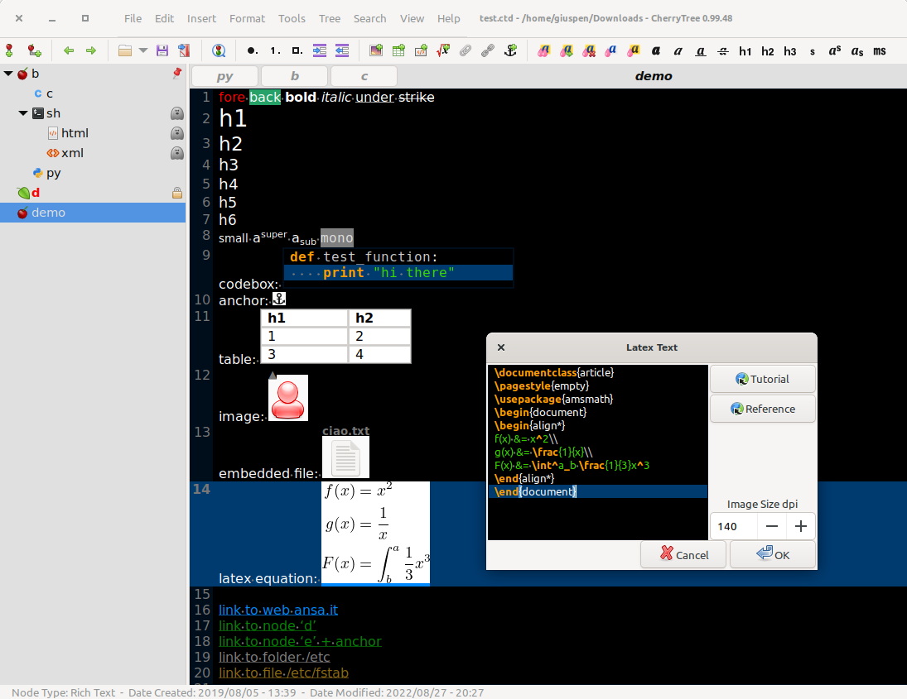

# CherryTree
A hierarchical note taking application, featuring rich text and syntax highlighting, storing data in either a single file (xml or sqlite) or multiple files and directories.
The project home page is [giuspen.net/cherrytree](https://www.giuspen.net/cherrytree/).

Written by Giuseppe Penone (aka giuspen) and Evgenii Gurianov (aka txe).

## Features
- Rich text (foreground color, background color, bold, italic, underline, strikethrough, small, h1, h2, h3, h4, h5, h6, subscript, superscript, monospace)
- Syntax highlighting supporting several programming languages
- Images handling: insertion in the text, edit (resize/rotate), save as png file
- Latex math equations rendering
- Embedded files handling: insertion in the text, save to disk
- Multi-level lists handling (bulleted, numbered, to-do and switch between them, multiline with shift+enter)
- Simple tables handling (cells with plain text), cut/copy/paste row, import/export as csv file
- Codeboxes handling: boxes of plain text (optionally with syntax highlighting) into rich text, import/export as text file
- Execution of the code for code nodes and codeboxes; the terminal and the command per syntax highlighting is configurable in the preferences dialog; an embedded terminal is available on linux and mac os
- Alignment of text, images, tables and codeboxes (left/center/right/fill)
- Hyperlinks associated to text and images (links to webpages, links to nodes/nodes + anchors, links to files, links to folders)
- Spell check (using [gspell](https://gitlab.gnome.org/GNOME/gspell))
- Intra application copy/paste: supported single images, single codeboxes, single tables and a compound selection of rich text, images, codeboxes and tables
- Cross application copy/paste (tested with libreoffice and gmail): supported single images, single codeboxes, single tables and a compound selection of rich text, images, codeboxes and tables
- Copying a list of files from the file manager and pasting in cherrytree will create a list of links to files, images are recognized and inserted in the text
- Print & save as pdf file of a selection / node / node and subnodes / the whole tree
- Export to html of a selection / node / node and subnodes / the whole tree
- Export to plain text of a selection / node / node and subnodes / the whole tree
- Toc generation for a node / node and subnodes / the whole tree, based on headers h1, h2, h3, h4, h5, h6 and text sections between headers collapsible
- Find a node, find in selected node, find in selected node and subnodes, find in all nodes
- Replace in nodes names, replace in selected node, replace in selected node and subnodes, replace in all nodes
- Iteration of the latest find, iteration of the latest replace, iteration of the latest applied text formatting
- Import from html file, import from folder of html files
- Import from plain text file, import from folder of plain text files
- Import from basket, cherrytree, epim html, gnote, keepnote, keynote, knowit, mempad, notecase, rednotebook, tomboy, treepad lite, tuxcards, zim
- Export to cherrytree file of a selection / node / node and subnodes / the whole tree
- Password protection (using https://www.7-zip.org/) available only for storage as single file – NOTE: while a cherrytree password protected document is opened, an unprotected copy is extracted to a temporary -folder of the filesystem; this copy is removed when you close cherrytree
- Tree nodes drag and drop
- Automatic link to web page if writing the URL
- Automatic link to node if writing node name surrounded by [[node name]]

## Prebuilt binaries
Prebuilt binaries can be found on [github.com/giuspen/cherrytree/releases](https://github.com/giuspen/cherrytree/releases) and [giuspen.net/cherrytree/#downl](https://www.giuspen.net/cherrytree/#downl).

## How to build from source code
To build from the source code, please read [BUILDING.md](BUILDING.md).

## Localization
The following languages are supported (if you want to help translate to your language, please write me):

– Arabic (ar, Abdulrahman Karajeh, TO BE UPDATED)
– Armenian (hy, Seda Stamboltsyan, up to date)
– Bulgarian (bg, Iliya Nikolaev, TO BE UPDATED)
– Chinese Simplified (zh_CN, Wang Yu, TO BE UPDATED)
– Chinese Traditional (zh_TW, Emer Chen, up to date)
– Croatian (hr, Filip Bakula, TO BE UPDATED)
– Czech (cs, Pavel Fric, up to date)
– Dutch (nl, TO BE UPDATED)
– English (en, default)
– Finnish (fi, TO BE UPDATED)
– French (fr, Francis Gernet, up to date)
– German (de, Mr.Update, up to date)
– Greek (el, Asterios Siomos, TO BE UPDATED)
– Hindi India (hi_IN, TO BE UPDATED)
– Hungarian (hu, Stiener Norbert, TO BE UPDATED)
– Italian (it, Vincenzo Reale, up to date)
– Japanese (ja, Piyo, up to date)
– Kazakh (kk_KZ, Viktor Polyanskiy, up to date)
– Kazakh (kk_LA, Latin, Viktor Polyanskiy, up to date)
– Korean (ko, Sean Lee, up to date)
– Lithuanian (lt, TO BE UPDATED)
– Persian (fa, Majid Abri, TO BE UPDATED)
– Polish (pl, Mariusz Gasperaniec, up to date)
– Portuguese (pt, Rui Santos, up to date)
– Portuguese Brazil (pt_BR, Raysa Dutra, up to date)
– Romanian (ro, Tudor Sprinceana, up to date)
– Russian (ru, Viktor Polyanskiy, up to date)
– Slovak (sk, Michal Fusatý, up to date)
– Slovenian (sl, Erik Lovrič, up to date)
– Spanish (es, MP, up to date)
– Swedish (sv, Åke Engelbrektson, TO BE UPDATED)
– Turkish (tr, Ferhat Aydin, TO BE UPDATED)
– Ukrainian (uk, Giuseppe Penone, up to date)

## Programming with GTKmm3
https://docs.huihoo.com/gtkmm/programming-with-gtkmm-3/3.17.50/en/

## Third party Android project SourCherry
Outstanding third party Android project: https://github.com/FFDA/SourCherry

## Code Signing Policy
- Free code signing for the Windows binaries provided by [SignPath.io](https://signpath.io/), certificate by [SignPath Foundation](https://signpath.org/)
- This program will not transfer any information to other networked systems unless specifically requested by the user or the person installing or operating it
- Approver: [Giuseppe Penone](https://github.com/giuspen)
